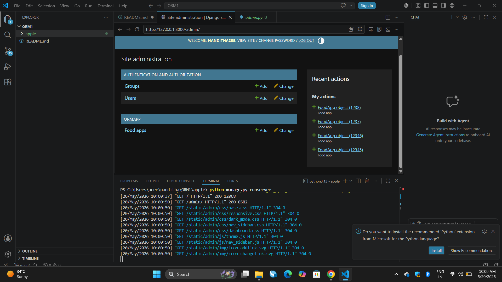
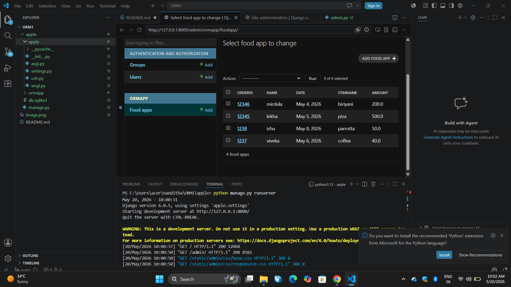

# Ex01 Django ORM Web Application
## Date: 

## AIM
To develop a Django application to manage an online food delivery platform like Zomato/Swiggy using Object Relational Mapping (ORM).

## ENTITY RELATIONSHIP DIAGRAM


## DESIGN STEPS

### STEP 1:
Clone the problem from GitHub

### STEP 2:
Create a new app in Django project

### STEP 3:
Enter the code for admin.py and models.py

### STEP 4:
Execute Django admin and create details for 10 books

## PROGRAM

```
from django.db import models
from django.contrib import admin

class FoodApp(models.Model):
    OrderID = models.IntegerField(primary_key=True)
    Name = models.CharField(max_length=30)
    Date = models.DateField()
    ItemName = models.CharField(max_length=100)
    Amount = models.FloatField()
    

class FoodAppAdmin(admin.ModelAdmin):
    list_display = (
        'OrderID',
        'Name',
        'Date',
        'ItemName',
        'Amount',
    )
    ```

```
from django.contrib import admin
from .models import FoodApp, FoodAppAdmin

admin.site.register(FoodApp, FoodAppAdmin)
```

## OUTPUT






## RESULT
Thus the program for creating a database using ORM hass been executed successfully
